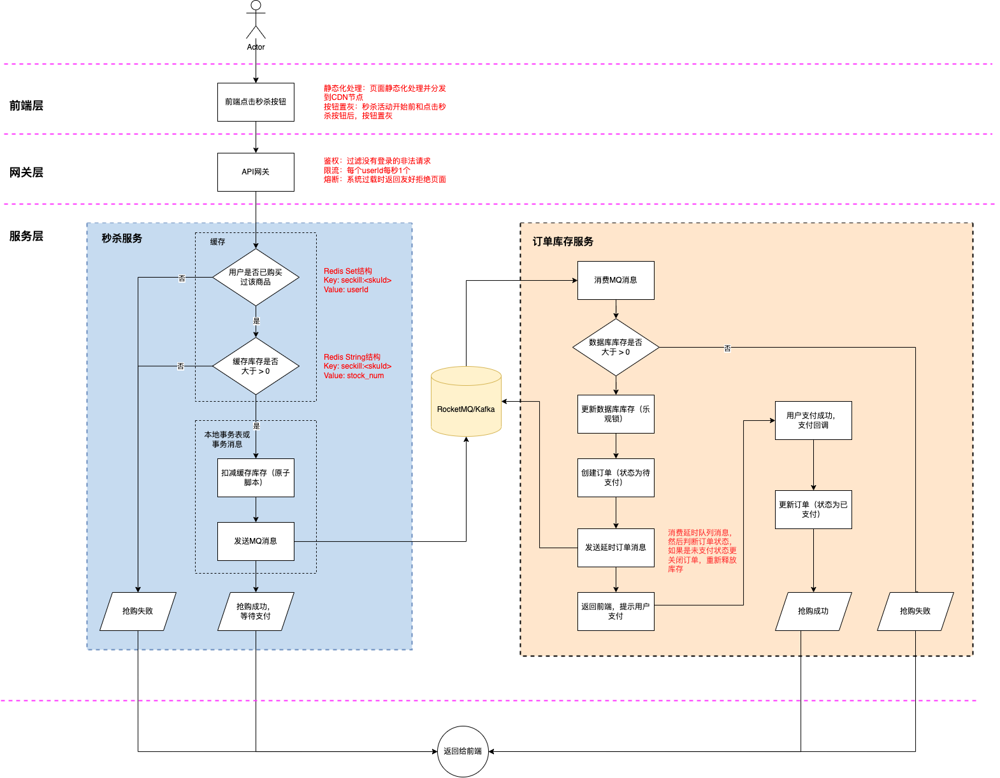

## 📖 项目简介

一个高并发、高性能秒杀系统实战项目。本项目旨在模拟电商平台中经典的秒杀场景，通过一系列技术手段解决**瞬时高并发、库存超卖、系统高可用**等核心挑战。

**核心特征**：

- **瞬时高并发处理**：应对海量用户同时抢购。
- **数据一致性保障**：确保库存扣减准确，防止超卖。
- **高性能与高可用**：通过多层次优化保障系统稳定。
- **防作弊与公平性**：尝试识别和限制恶意请求。

## 🔧 整体思路设计

项目结构分层：

| 层级           | 作用                                                         | 优化思路                                                     |
| -------------- | ------------------------------------------------------------ | ------------------------------------------------------------ |
| **前端层**     | 面向用户，展示商品详情，提供秒杀入口                         | 通过页面静态化、CDN加速、秒杀按钮置灰、图形验证码，过滤掉大部分过滤掉大部分低阶脚本和手动刷子 |
| **网关层**     | 负责限流、鉴权和请求分发                                     | 通过限流、鉴权和熔断等手段拦截非法请求和防止流量过载         |
| **业务服务层** | 负责核心业务逻辑（如库存判断、订单生成），可以划分为秒杀服务、订单服务、库存服务等 | 独立秒杀服务，使用缓存 + 异步化保证高性能，原子脚本 + 事务保证原子性 |
| **缓存层**     | 承担绝大部分的读请求和库存扣减操作                           | 缓存预热，合理数据结构设计                                   |
| **数据库层**   | 最终的数据持久化                                             | 扣减库存使用乐观锁，杜绝超卖问题                             |

秒杀活动整体流程：



## 📋 项目结构

```
.
├── imseckill-auth       # 认证服务
├── imseckill-business   # 业务服务（订单库存服务）
├── imseckill-cache      # 缓存服务
├── imseckill-gateway    # API网关
└── imseckill-seckill    # 秒杀服务
```

## 🛠️ 技术栈

| 技术                       | 版本       | 说明                                                 |
|:-------------------------| ---------- | :--------------------------------------------------- |
| **Java 8**               | 1.8        | 主语言                                               |
| **Spring Boot**          | 2.7.2      | 应用框架                                             |
| **Spring Cloud Alibaba** | 2021.0.5.0 | 微服务套件                                           |
| **Spring Cloud Gateway** | 3.1.5      | 网关                                                 |
| **MySQL**                | 8.0.32     | 关系型数据库，存储商品、订单信息                     |
| **Redis**                | 6.2.14     | 分布式缓存，用于库存预热、缓存数据、分布式锁、限流等 |
| **Kafka**                | 2.13-2.6.0 | 消息队列，用于异步下单、削峰填谷                     |
| **Nacos**                | 2.2.3      | 服务注册与发现、配置中心                             |
| **Sentinel**             | 1.8.6      | 流量控制、熔断降级                                   |

